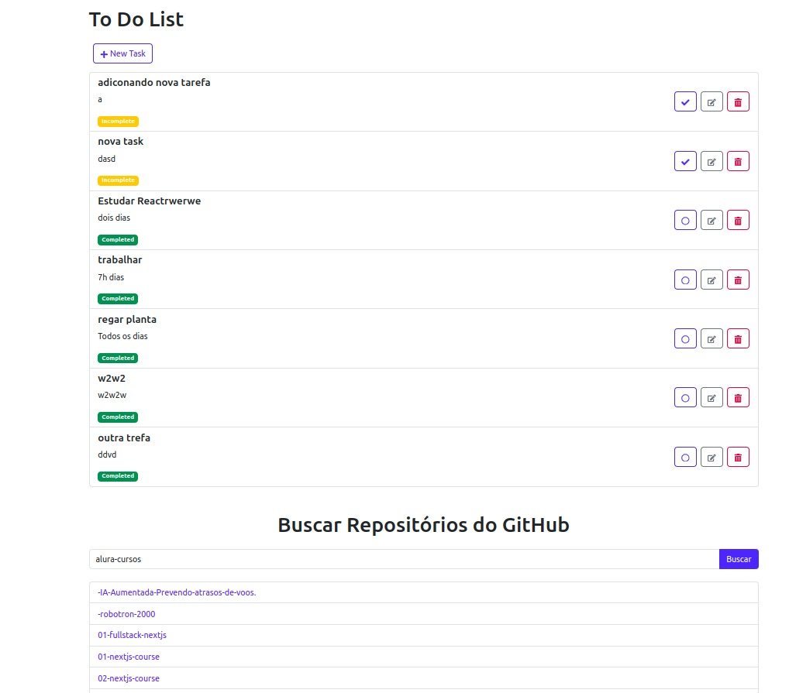

# **To-Do List API**

This Laravel application, integrated with React, functions as a RESTful API to manage a to-do list. It provides features to create, list, update, and delete tasks, with the option to filter tasks by completion status, using `0` for incomplete and `1` for completed tasks.

Main Project Page
The main page of the project is /todolist, where users can view the list of tasks, add new tasks, and interact with existing ones (mark as complete, edit, or delete) and choose the repos by user.

## **Requirements**

- PHP version 8.0 or higher
- Composer
- MySQL database
- Laravel framework
- React library
- Apache web server
- Linux for development environment

## **Installation**

### **Backend Setup (Laravel)**

2. Install Laravel dependencies:
   ```bash
   composer install
   ```

3. Configure the `.env` file:
   - Create a copy of the `.env.example` file:
     ```bash
     cp .env.example .env
     ```
   - Set up the database details in the `.env` file:
     ```plaintext
     DB_CONNECTION=mysql
     DB_HOST=127.0.0.1
     DB_PORT=3306
     DB_DATABASE=todo_list
     DB_USERNAME=your_username
     DB_PASSWORD=your_password
     ```

4. Generate the application key:
   ```bash
   php artisan key:generate
   ```

5. Run migrations to create the database tables:
   ```bash
   php artisan migrate
   ```

6. Start the Laravel server:
   ```bash
   php artisan serve
   ```

### Frontend Setup (React)
Install React (if not already installed) in your resources/js folder:

npm install react react-dom axios

1. Navigate to the `resources/js` directory:
   ```bash
   cd resources/js
   ```

2. Install necessary dependencies with `npm`:
   ```bash
   npm install
   ```

3. Compile the React application using Laravel Mix:
   ```bash
   npm run dev
   ```

4. For production, use:
   ```bash
   npm run production
   ```

### Configure Laravel Mix (webpack.mix.js)
   - The `webpack.mix.js` file is configured to compile React files in the `resources/js` directory. Make sure you have this configuration:
   ```javascript
   const mix = require('laravel-mix');

   mix.react('resources/js/app.js', 'public/js')
      .sass('resources/sass/app.scss', 'public/css');
   ```

### React Configuration (package.json)

- Ensure that `package.json` has the necessary dependencies for React, including Babel for transpiling JSX:
  ```json
  {
    "name": "aiogroup",
    "version": "1.0.0",
    "private": true,
    "scripts": {
      "dev": "mix",
      "watch": "mix watch",
      "production": "mix --production"
    },
    "dependencies": {
      "axios": "^0.27.2",
      "react": "^18.2.0",
      "react-dom": "^18.2.0"
    },
    "devDependencies": {
      "babel-eslint": "^10.1.0",
      "babel-preset-react": "^6.24.1",
      "laravel-mix": "^6.0.49",
      "webpack": "^5.71.0"
    }
  }
  ```

## API Endpoints

### 1. Create Task

- **Description:** Creates a new task in the list.
- **Method:** `POST`
- **Endpoint:** `/api/tasks`
- **Request Example:**
  ```json
  {
      "title": "New Task",
      "description": "Task description",
      "is_completed": 1
  }
  ```
- **Success Response:** `201 Created`
  ```json
  {
      "task": {
          "id": 1,
          "title": "New Task",
          "description": "Task description",
          "is_completed": 1,
          "created_at": "2024-11-06T10:00:00.000000Z",
          "updated_at": "2024-11-06T10:00:00.000000Z"
      }
  }
  ```

### 2. List Tasks

- **Description:** Lists all tasks, with an optional status filter (completed/not completed).
- **Method:** `GET`
- **Endpoint:** `/api/tasks`
- **Filter Parameter:** `is_completed` (optional)
  - `1` to list only completed tasks
  - `0` to list only incomplete tasks

- **Request Example Without Filter:**
  ```http
  GET /api/tasks
  ```

- **Request Example With Filter (Completed Tasks):**
  ```http
  GET /api/tasks?is_completed=1
  ```

- **Success Response:**
  ```json
  {
      "tasks": [
          {
              "id": 1,
              "title": "Example Task",
              "description": "Task description",
              "is_completed": 1,
              "created_at": "2024-11-06T10:00:00.000000Z",
              "updated_at": "2024-11-06T10:00:00.000000Z"
          }
      ]
  }
  ```

### 3. Update Task Status

- **Description:** Updates the completion status of a task.
- **Method:** `PATCH`
- **Endpoint:** `/api/tasks/{id}/status`
- **Request Example:**
  ```json
  {
      "is_completed": 1
  }
  ```
- **Success Response:** `200 OK`
  ```json
  {
      "message": "Task updated successfully.",
      "task": {
          "id": 1,
          "title": "New Task",
          "description": "Task description",
          "is_completed": 1,
          "created_at": "2024-11-06T10:00:00.000000Z",
          "updated_at": "2024-11-06T10:00:00.000000Z"
      }
  }
  ```

- **Error Response (if task not found):** `404 Not Found`
  ```json
  {
      "message": "Task not found."
  }
  ```

### 4. Delete Task

- **Description:** Deletes a task from the list.
- **Method:** `DELETE`
- **Endpoint:** `/api/tasks/{id}`
- **Success Response:** `204 No Content`
  ```json
  {
      "message": "Task deleted successfully."
  }
  ```

## Frontend Features (React)

### Task List Features:

1. **Add Task:** 
   - A form to add new tasks. Sends a `POST` request to the API.
   
2. **List Tasks:**
   - Displays all tasks, with options to filter by `is_completed`. Tasks are fetched using a `GET` request.

3. **Mark Task as Complete/Incomplete:**
   - Users can toggle the task status between `complete` and `incomplete`. This sends a `PATCH` request to update the `is_completed` field.

4. **Delete Task:**
   - Each task can be deleted with a `DELETE` request.

**React Components:**

- `TaskList`: Displays a list of tasks with buttons to mark as complete/incomplete or delete them.
- `TaskForm`: A form to add new tasks to the list.


### Example of `app.js`:

```javascript
import React from 'react';
import ReactDOM from 'react-dom';
import TaskList from './components/TaskList';
import TaskForm from './components/AddTaskForm';

ReactDOM.render(
  <React.StrictMode>
    <TaskForm />
    <TaskList />
  </React.StrictMode>,
  document.getElementById('root')
);
```

---

## Task API Tests

This set of tests ensures the proper functioning of the CRUD (Create, Read, Update, Delete) operations in the Task API. The tests are conducted using Laravel's testing framework (`TestCase`), and below are the descriptions of each implemented test.

### Implemented Tests

#### 1. **Tests Task Creation via API**
   - **Objective:** Verify that task creation works correctly.
   - **Flow:**
     - Sends a `POST` request to the `/api/tasks` route with valid data.
     - Verifies that the response status is `201 Created`.
     - Confirms that the task data (title and description) is present in the JSON response.
     - Validates that the task was correctly inserted into the database.
   - **Method:** `test_task_creation_integration`

#### 2. **Tests Task Update**
   - **Objective:** Validate the behavior of the API when updating an existing task.
   - **Flow:**
     - Creates an initial task in the database.
     - Sends a `PUT` request to the `/api/tasks/{id}` route with new data for the task.
     - Verifies that the response status is `200 OK`.
     - Validates that the response contains the updated task data.
     - Confirms that the updated data was correctly saved in the database.
   - **Method:** `test_task_update`

#### 3. **Tests Task Creation Validation (Required Field)**
   - **Objective:** Ensure that creating a task without the required fields results in the appropriate error.
   - **Flow:**
     - Sends a `POST` request to the `/api/tasks` route without the required fields (in this case, the task title).
     - Verifies that the response status is `422 Unprocessable Entity`.
     - Validates that the validation error for the `title` field is returned.
   - **Method:** `test_task_creation_validation`

#### 4. **Tests Task Listing After Creation**
   - **Objective:** Verify that the task list is returned correctly after a new task is created.
   - **Flow:**
     - Creates a new task via the API.
     - Sends a `GET` request to the `/api/tasks` route to list all tasks.
     - Verifies that the response status is `200 OK`.
     - Confirms that the newly created task is present in the returned list.
     - Verifies that the task was correctly saved in the database.
   - **Method:** `test_task_list_after_creation`

---

### Running the Tests

To run the tests in your local environment, follow these steps:

1. **Install the project dependencies**:
   ```
   composer install
   ```

2. **Configure the test environment**:
   Ensure that the `.env.testing` file is properly configured for the testing environment.

3. **Run the tests**:
   To run all tests, execute the following command in the terminal:
   ```
   php artisan test
   ```

### Technologies Used

-  - PHP framework for web development
-  - JavaScript library for building user interfaces
-  - Dependency manager for PHP
-  - Database
-  - Backend programming language
-  - Web server
-  - Development environment
Here’s a suggestion for your final note in the README:

---

### Final Consideration

This project was developed using Laravel and React to manage a task list. Although I intended to create additional components to enhance the task list, I ran out of time. Despite this, the current implementation provides a solid foundation for managing tasks efficiently. I look forward to expanding the project in the future with more features and improvements.

---
## License

This project is licensed under the [MIT License](https://opensource.org/licenses/MIT).
